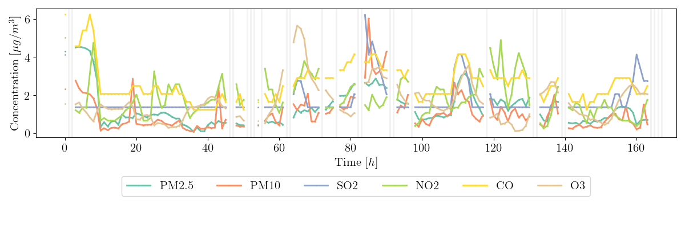

# BERT for Multivariate Time Series Imputation

This repository provides code for multivariate time series imputation on air quality data using both dynamic and static features. The model leverages the BERT (Bidirectional Encoder Representations from Transformers) architecture to capture a deep, bidirectional understanding of the time series.

Time series imputation is framed similarly to masked token prediction in NLP, where the model learns to predict missing values based on their surrounding context. Each time step in the multivariate time series is treated as a token and mapped to an embedding space, with positional embeddings encoding the sequence order. The loss function used is Mean Squared Error (MSE) on the masked time points. For details on the model architecture, see `src/transformer_utils.py`.

## Dependencies

The code requires a CUDA-enabled GPU. The following conda environment can be built and activated to run the code. 
```
conda env create -f environment.yml
conda activate bert
```
The environment `bert` contains all necessary packages and uses Python version 3.12.

## Data

Beijing Multi-Site Air Quality dataset is used for the implementation. Download the data and save the `.csv` files in the `data/raw_data` directory of the project. Run the following code to create a single data file
```
python src/data_utils.py
```
### Data Description

This data set includes hourly air pollutants data from 12 nationally-controlled air-quality monitoring sites. 

- Hourly time series of six important air pollutants - PM2.5, PM10, SO2, NO2, CO, and O3 is used for imputation. 
- Time series, grouped by their monitoring site, are split into weekly segments (168 hours). 
- Static features include temperature summary, average air pressure, and site indicators. 
- 10% of time points are randomly masked for imputation, with mask widths sampled from a Poisson distribution. 
- The dataset consists of 2,496 weeks, split 80/10/10 into train, validation, and test sets. 

The figure below shows the six masked time series from a random week. 


## Training

To train the model run:

```
python src/transformer_impute.py --embed_dim 256 --depth 4 --n_heads 4 --mask_avg_len 2 --mask_prob 0.1 --num_epochs 200 --batch_size 512 --learning_rate 1e-4 --static 0
```
where
- `embed_dim` is the embedding dimension.
- `depth` is the number of transformer blocks in the model.
- `n_heads` is the number of attention heads.
- `mask_avg_len` is the rate parameter of the Poisson distribution used for sampling masking width.
- `mask_prob` is the masking probability.
- `static` is the indictor for whether to use static features.


